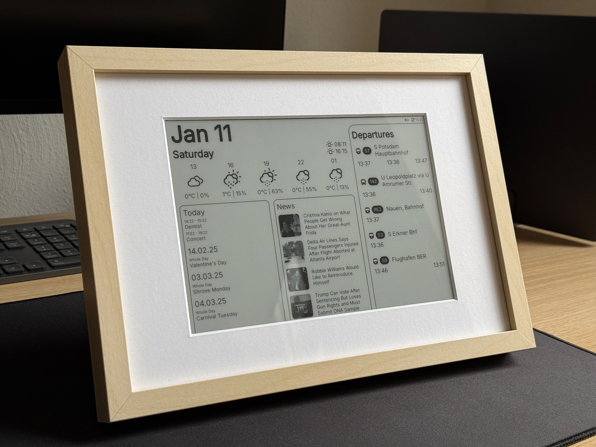
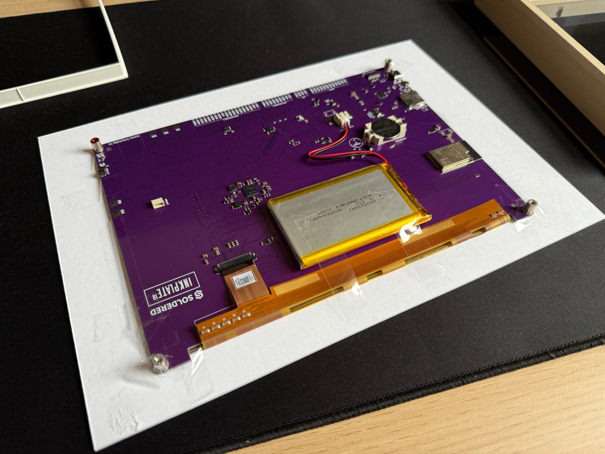
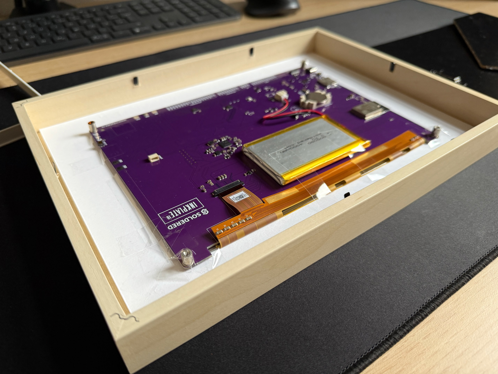
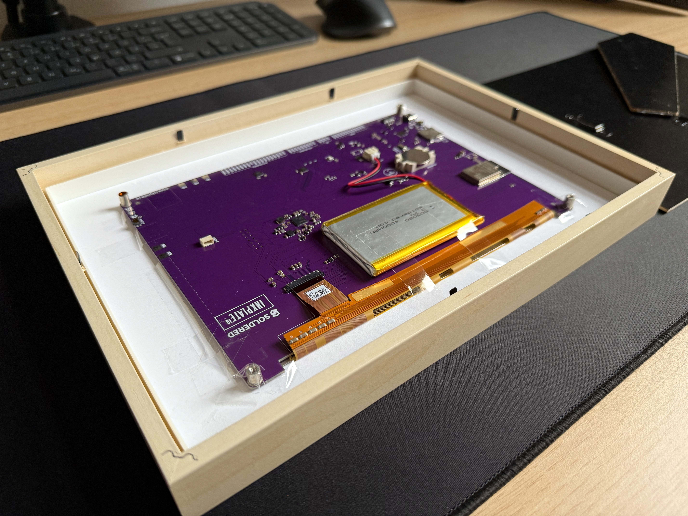
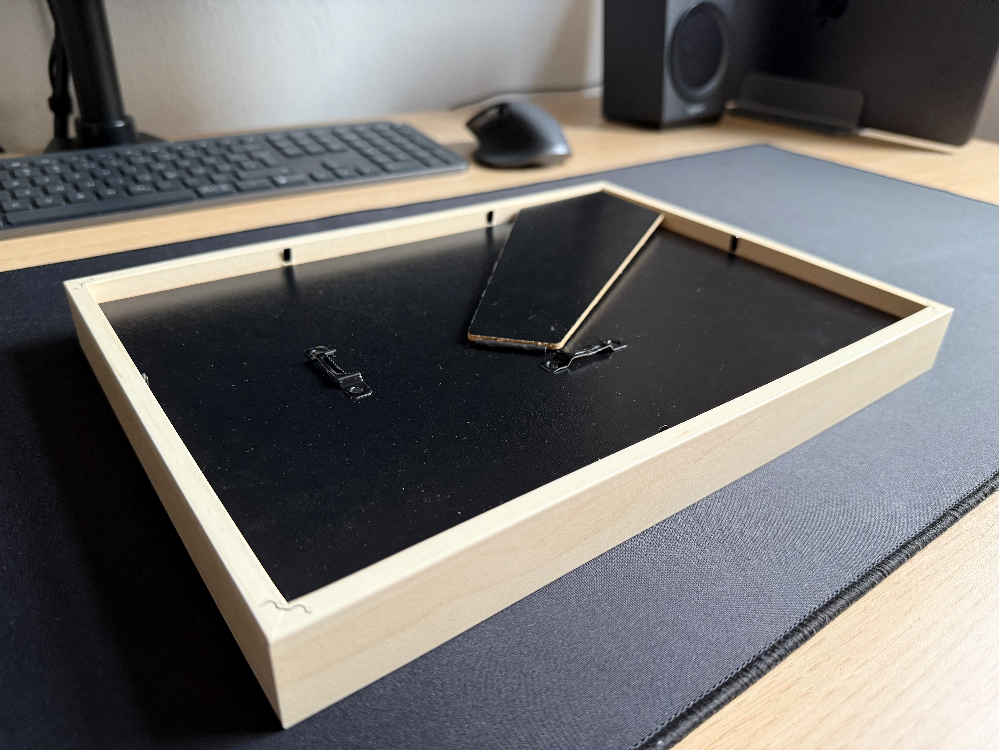
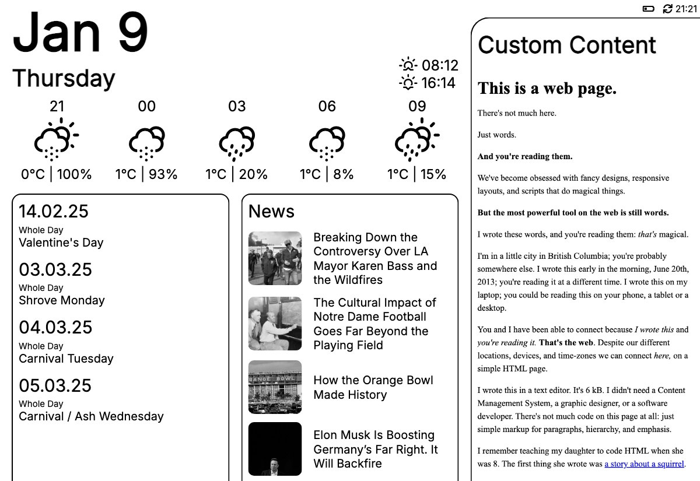
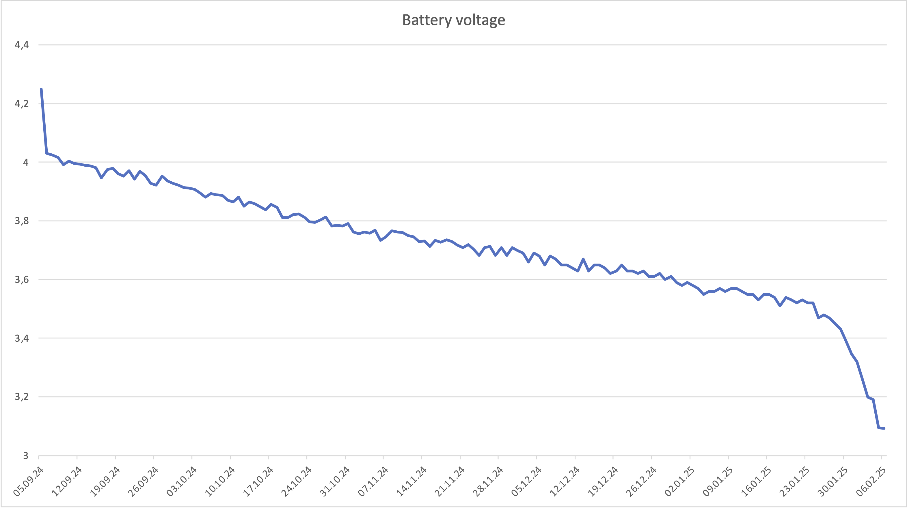

# Inkplate Dashboard

This is a dashboard that displays the weather, news, your calendar events and other useful information all at a glance. It uses the Inkplate 10 as a hardware client and provides the dashboard via a google cloud function.



# Table of Contents

1. [Features](#features)
2. [How it works](#how-it-works)
3. [Requirements](#requirements)
4. [Setup](#setup)
5. [Usage](#usage)
6. [Battery Life](#battery-life)
7. [Related Projects and used Dependencies](#related-projects-and-used-dependencies)
8. [Contributing](#contributing)

## Features

- Weather, temperature and precipitation for the next few hours
- Next sunrise and sunset
- Combined calendar events from any `ical` URLs you specify
- News or RSS feed items with images
- Public transport departures for the lines you specify, or custom content in form of any website you want
- Gallery mode with random picture selection

## How it works

The project follows a "dumb client - smart server" approach. This helps minimize the processing effort on the client side and thus makes the battery last longer.

The e-ink display only displays the dashboard image it fetches every x minutes (40 minutes by default), and checks if it should wait longer (120 minutes by default) to refresh again during night hours specified in the config.

The server is a google cloud function that is executed when the endpoint is called. It fills an html template with all necessary elements after fetching the relevant data from corresponding endpoints, and then makes a screenshot of the final html page using puppeteer. This screenshot is then returned within the endpoint.

If gallery mode is enabled, the endpoint solely picks a random image from the directory and returns that.

## Requirements

### Hardware

- 1x [Soldered Inkplate 10](https://soldered.com/product/inkplate-10-9-7-e-paper-board-copy/) - the dashboard and client implementation is **heavily customized** to the dimensions and corresponding hardware of the **inkplate 10** e-ink display/controller. You can use the server separately with your own implementation, but you may need to adapt the html layout to fit the dimensions of your display. If you buy from the official store, you can also buy the inkplate together with a plastic case and a battery.
- 1x 3.7V Li-Ion flat battery with standard JST 2mm female connector - you can use any battery that fits these requirements, I just bought [this 4000mAh one](https://soldered.com/product/li-ion-battery-4000mah-3-7v/) from the soldered store. You can also buy the inkplate 10 with a battery straight away, however it has "only" 3000mAh.

**(OPTIONAL) Picture frame**
- One picture frame that supports these dimensions inside it: 224.3mm (width) x 163mm (height) x 10 mm (depth). I use [this IKEA RÖDALM 21x30cm picture frame](https://www.ikea.com/de/de/p/roedalm-rahmen-birkenachbildung-20548881/) with birch wood.
- A white passepartout frame with dimensions 210x297mm and a centered cutout with the dimensions 195x134mm. You can try to make this cutout yourself with the passepartout that's usually provided with the picture frame, but if you can spare some pocket change, I recommend ordering one because it looks miles better than an amateur scissor cutout. Make sure the thickness is sufficient to support the weight of the inkplate.
- Glue, double sided and/or single sided sticky tape to put all of the stuff together.

### Software

- google cloud project and account, with google cloud run functions enabled
- already configured google cloud cli with your credentials and defaults
- PlatformIO VScode extension

## Setup

### Server

The backend is a cloud function that generates an image when its endpoint is triggered. to set it up, you need to follow the following steps:

1. Rename `config-sample.ts` to `config.ts` and modify the fields accordingly (alternatively, use `config-berlin.ts` as a starting point). For more info, check the comments within the file.
2. Run `npm start` in the `server` directory to check if the image is generated correctly. if everything works fine, we can proceed with the deployment.
3. `npm run deploy` will deploy the gcloud function if everything was set up accordingly. It will use the defaults you specified in your gcloud cli, so if you want to deploy it in a region different from the default one, you can adapt the `deploy` command in `package.json`.

### Client

After you turn on your inkplate dashboard, I recommend you get familiar with its functionality and behavior using some sample projects and the arduino IDE. [Check out the official docs](https://inkplate.readthedocs.io/en/latest/get-started.html#arduino). If you want to get started straight away, follow these steps:

1. First, rename `config_example.h` to `config.h` and modify the fields accordingly. Follow the instructions in the file.
2. Connect your inkplate via USB to your computer and make sure it's recognized by the computer.
3. In the PlatformIO (PIO) tab, you should see project tasks for `ìnkplate10v2`. There is a `Debug and Monitor` option. Alternatively you can use the `Upload` task to upload the code to the inkplate.
4. Click on it, and the code should compile and deploy to the inkplate automatically.
5. That's it! If you wait a bit and everything is configured correctly, the inkplate should display the dashboard after a minute max.

### Building the dashboard into the picture frame (optional)

If you want to, you can just skip this step and put the inkplate in the frame you bought it with, or just build it into whatever you want. If you want the "framed image" look, follow these steps:

1. Glue the battery to the back of the inkplate 10. Either use double sided sticky tape or glue.
2. Glue the inkplate 10 to the back side of the passepartout, with the display inside the frame on the other side. Make sure to align the borders properly, I recommend doing this step with the dashboard already displayed on the inkplate, because it makes easier to align. You can also deviate from my contraption and use something more structurally sound instead of just some sticky tape.

3. After you're done with some testing that the display works as expected, make sure to charge the battery to the full level.
4. (optional) Flick the tiny switch on the inkplate to disable the "on"-light. The switch is located near the CMOS battery.
5. Put the passepartout with the dashboard into the picture frame, you might need to remove the supporting frame because there's not enough room.
<p float="left">
  
  
</p>
6. Put the backboard into the picture frame and make sure everything is fixed and stable and you're done!



## Usage

The dashboard has two modes, dashboard mode and gallery mode. The latter is for just displaying randomly pictures you put in a folder.

### Gallery mode

To enable gallery mode, you need to set `MODE: gallery` in the `.env.yaml` or the deployed cloud function `MODE` parameter. Make sure to put your images in the `server/src/layout/images` path first.

### Public transport

This dashboard currently only supports public transport for Berlin (BVG). To get started with the required stop IDs, [check out this page](https://v6.bvg.transport.rest/getting-started.html). 

If you want to use it for a different city, you can customize `transportDepartures.ts` using an endpoint for your local region.

### RSS Feeds

Be aware that the current implementation only supports images through embedding with an `` tag in the `content:encoded` property. Not all RSS feeds do this, so your feed might display without images. You can adapt the implementation in `news.ts`.

### Custom Content



To display custom content in the right side pane, adapt this content in `config.ts`:

```
export const customContent = {
    enabled: true,
    title: "Custom Content Title",
    // the url to fetch the custom content from
    url: "https://sample.url",
};
```

Each time the dashboard refreshes, it will attempt to make a screenshot of the website URL you provided. Be aware that it will be displayed in black-and-white on a dashboard with a white background, so ideally you should use some layout that has a white background and is as simple as possible.

The implementation automatically resizes the window frame to fit the side pane and scales the content up by 1.5 times.

### Other configuration options

`config.ts` and `config.h` allow you to configure:

- refresh intervals
- reduced refresh hours
- battery voltage indicator levels
- whether to display the sunrise and sunset times inlined into the weather row

and more!

## Battery Life



With the default configuration (refresh interval of 40 minutes and 120 minutes at night), a 4000mAh 3.7V battery lasts 4 months without recharging. Depending on your interval and battery size, this can vary.

## Related Projects and used Dependencies

### Inspiration

- [eink-weather-display](https://github.com/kimmobrunfeldt/eink-weather-display) - main inspiration for the overall look of the dashboard and general communication between server-client
- [Inkplate 10 Weather Calendar](https://github.com/chrisjtwomey/inkplate10-weather-cal) another very cool e-ink dashboard that uses inkplate and PlatformIO
- [gcloud functions template](https://github.com/jgunnink/typescript-cloud-function-template
) - used as a template for the `server` folder structure and cloud function deployment

### Dependencies

- puppeteer
- rss-parser
- sharp
- axios
- node-ical
- google-cloud/functions-framework
- weather-icons

### APIs

- [Open-Meteo](https://open-meteo.com/) - Weather and sunset/sunrise
- [BVG-REST](https://v6.bvg.transport.rest/) - Fetching public transport departures in Berlin
- [World Time API](http://worldtimeapi.org/) - Fetching time on client

## Contributing

You can always suggest new features or report bugs that you found. Just keep in mind that this is mainly a project I did for private use and am only working on from time to time. Feel free to open an issue or fork the repository, and I'll look at it sooner or later.
